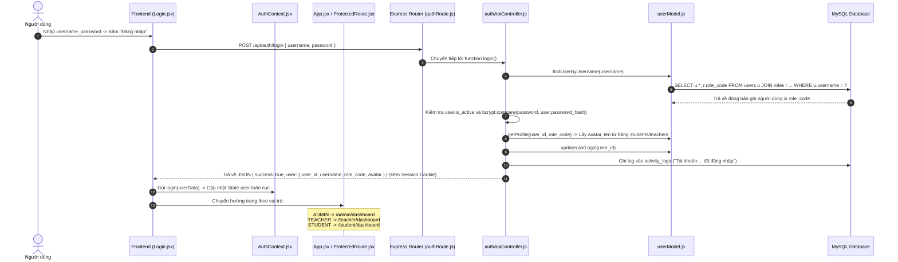
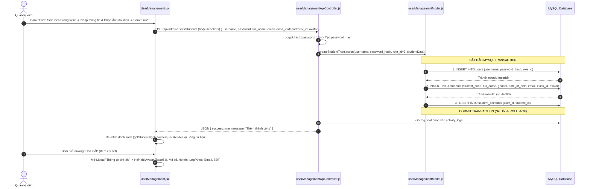
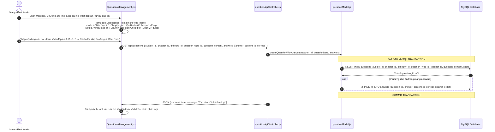
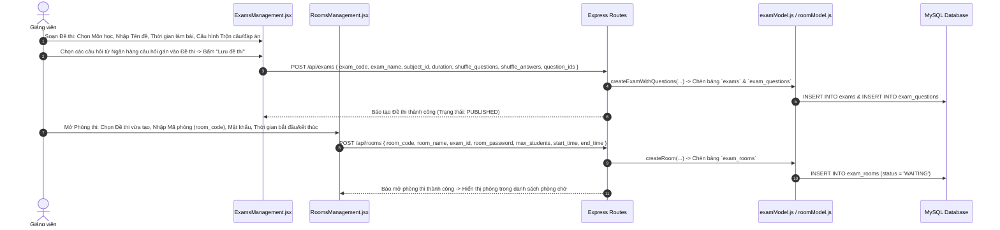
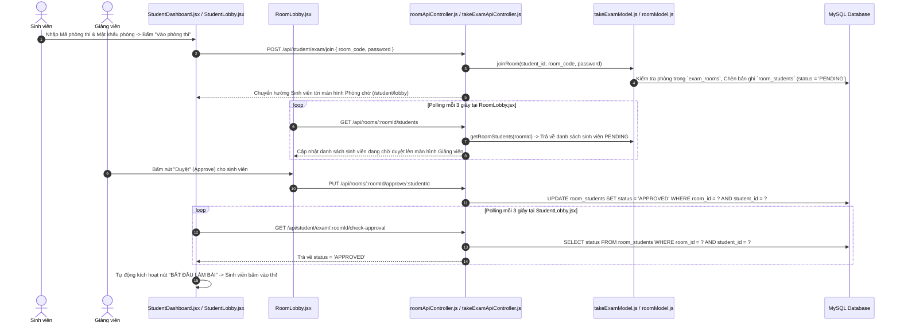
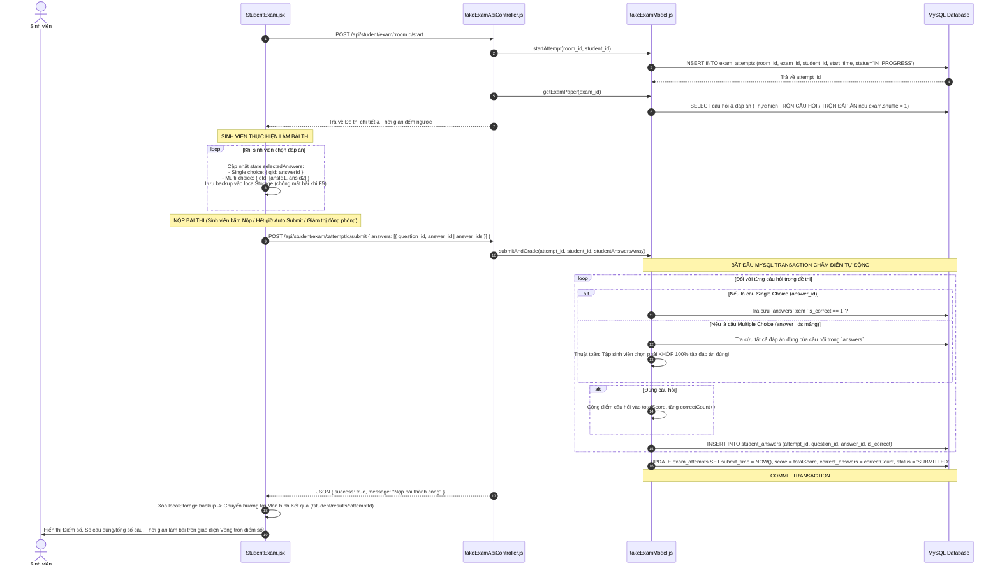
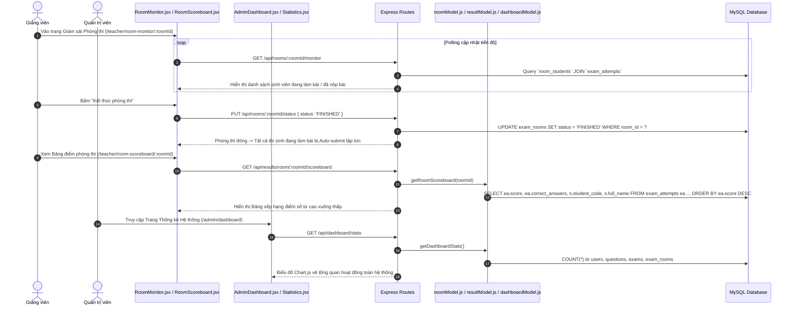

# BÁO CÁO TOÀN DIỆN & WORKFLOW HỆ THỐNG THI TRẮC NGHIỆM TRỰC TUYẾN

Hệ thống Quản lý và Tổ chức Thi Trắc nghiệm Trực tuyến (**Online Quiz & Exam System**) được thiết kế theo mô hình kiến trúc phân tầng (Multi-tier Architecture / MVC), đảm bảo toàn bộ luồng dữ liệu từ lúc **Người dùng thao tác -> Frontend xử lý & truyền tải -> Backend tiếp nhận & tính toán -> Database lưu trữ & truy vấn -> Phản hồi kết quả hiển thị cho Người dùng** diễn ra chính xác, bảo mật và thời gian thực.

---

## 1. TỔNG QUAN CÔNG NGHỆ & BẢN ĐỒ FILE HỆ THỐNG

### 1.1. Công nghệ Sử dụng (Tech Stack)
- **Frontend**: React.js (v19) + Vite (v8), React Router DOM (v7), Custom CSS3 (Dark Mode & Glassmorphism), Axios HTTP Client, Lucide React Icons, Chart.js & React-ChartJS-2.
- **Backend**: Node.js (v24) + Express.js Framework, `express-session` (Quản lý phiên), `bcrypt` (Mã hóa mật khẩu 10 salt rounds), `mysql2/promise` (Connection Pool & Async Transactions).
- **Database**: MySQL 8.0 / InnoDB Engine / Bảng mã `utf8mb4_unicode_ci`.

### 1.2. Sơ đồ Mapping Tất cả các File trong Dự án

```text
D:\Website Thi trắc nghiệm - Copy/
├── backend/
│   ├── config/
│   │   └── db.js                        # Tạo mysql2 connection pool kết nối MySQL
│   ├── controllers/
│   │   ├── accountApiController.js       # Xử lý đổi mật khẩu tài khoản cá nhân
│   │   ├── activityLogApiController.js   # Xử lý lấy nhật ký hoạt động hệ thống
│   │   ├── authApiController.js          # Xử lý Đăng nhập, Đăng xuất, Đăng ký, Lấy thông tin phiên (/me)
│   │   ├── chapterApiController.js       # Xử lý Thêm, Sửa, Xóa chương của môn học
│   │   ├── classApiController.js         # Xử lý Danh mục Lớp học
│   │   ├── dashboardApiController.js     # Xử lý Thống kê tổng quan cho Admin
│   │   ├── departmentApiController.js    # Xử lý Danh mục Khoa
│   │   ├── examApiController.js          # Xử lý Soạn đề thi, Đóng gói đề thi, Gán câu hỏi
│   │   ├── notificationApiController.js  # Xử lý Gửi và Đọc thông báo
│   │   ├── questionApiController.js      # Xử lý Ngân hàng câu hỏi & Đáp án (Single/Multi choice)
│   │   ├── resultApiController.js        # Xử lý Lịch sử thi & Bảng điểm phòng thi
│   │   ├── roomApiController.js          # Xử lý Quản lý phòng thi, Duyệt sinh viên, Đóng phòng thi
│   │   ├── subjectApiController.js       # Xử lý Danh mục Môn học & Phân công giảng dạy
│   │   ├── takeExamApiController.js      # Xử lý Vào phòng, Bắt đầu thi, Kiểm tra trạng thái & Nộp bài
│   │   └── userManagementApiController.js# Xử lý Quản lý Sinh viên, Giảng viên, Đổi trạng thái khóa/mở
│   ├── database/
│   │   └── quizz-system.sql              # Schema CSDL + Seed Data (Khóa, Lớp, Môn, Chương, Tài khoản test)
│   ├── helpers/
│   │   └── profileHelper.js              # Helper quy đổi user_id sang student_id / teacher_id
│   ├── middlewares/
│   │   └── authMiddleware.js             # Middleware kiểm tra Session (requireApiLogin) & Phân quyền (authorizeRoles)
│   ├── models/
│   │   ├── activityLogModel.js           # Ghi và truy vấn nhật ký hoạt động (activity_logs)
│   │   ├── chapterModel.js              # Truy vấn CRUD chương học (chapters)
│   │   ├── classModel.js                # Truy vấn lớp học (classes)
│   │   ├── dashboardModel.js            # Tính toán thống kê tổng số lượng (dashboardStats)
│   │   ├── departmentModel.js           # Truy vấn khoa (departments)
│   │   ├── examModel.js                 # Truy vấn đề thi (exams, exam_questions)
│   │   ├── notificationModel.js         # Truy vấn thông báo (notifications)
│   │   ├── questionModel.js             # Truy vấn câu hỏi & đáp án (questions, answers, question_types)
│   │   ├── resultModel.js               # Truy vấn lịch sử làm bài & bảng điểm phòng thi (exam_attempts)
│   │   ├── roomModel.js                 # Truy vấn phòng thi & duyệt sinh viên (exam_rooms, room_students)
│   │   ├── subjectModel.js              # Truy vấn môn học & phân công (subjects, teacher_subjects)
│   │   ├── takeExamModel.js             # Logic vào phòng, cấp đề, chấm điểm tự động & lưu kết quả
│   │   ├── userManagementModel.js       # Truy vấn người dùng (users, students, teachers, student_accounts, teacher_accounts)
│   │   └── userModel.js                 # Truy vấn tài khoản & hồ sơ cá nhân
│   ├── routes/                          # 15 Route Express tương ứng các đường dẫn API (/api/...)
│   └── app.js                           # Entry point Express: Đăng ký Cors, Session, Express Static, Routes
│
├── frontend/src/
│   ├── api.js                           # Axios Instance với baseURL `http://localhost:3000/api`, withCredentials = true
│   ├── components/
│   │   ├── MainLayout.jsx               # Khung Giao diện chung (Sidebar navigation, Header thông tin user, Button Logout)
│   │   └── ProtectedRoute.jsx           # Bảo vệ Route theo vai trò (ADMIN, TEACHER, STUDENT)
│   ├── context/
│   │   └── AuthContext.jsx              # React Context lưu trữ & cung cấp state `user` cho toàn bộ ứng dụng
│   ├── pages/
│   │   ├── Login.jsx                    # Màn hình Đăng nhập
│   │   ├── admin/
│   │   │   ├── AdminDashboard.jsx       # Thống kê tổng quan Admin
│   │   │   ├── Statistics.jsx           # Biểu đồ và thống kê chi tiết hệ thống
│   │   │   ├── SystemManagement.jsx     # Quản lý Khoa, Khóa học, Lớp học, Môn học, Chương
│   │   │   └── UserManagement.jsx       # Quản lý Sinh viên, Giảng viên, Đổi mật khẩu, Khóa/Mở tài khoản
│   │   ├── common/
│   │   │   ├── ExamsManagement.jsx      # Quản lý Soạn đề thi & Gán câu hỏi
│   │   │   ├── Notifications.jsx        # Xem và Quản lý Thông báo
│   │   │   ├── QuestionsManagement.jsx  # Quản lý Ngân hàng câu hỏi (Tạo câu 1 đáp án / nhiều đáp án)
│   │   │   ├── RoomsManagement.jsx      # Quản lý Phòng thi (Mở phòng, mã phòng, mật khẩu)
│   │   │   └── UserProfile.jsx          # Xem & Chỉnh sửa hồ sơ cá nhân (Avatar, SĐT, Địa chỉ)
│   │   ├── student/
│   │   │   ├── StudentDashboard.jsx     # Trang chủ Sinh viên (Vào thi nhanh bằng mã phòng)
│   │   │   ├── StudentExam.jsx          # Giao diện Thi trực tuyến (Đồng hồ đếm ngược, Map câu hỏi, Nộp bài)
│   │   │   ├── StudentHistory.jsx       # Lịch sử bài thi đã làm
│   │   │   ├── StudentLobby.jsx         # Phòng chờ sinh viên đợi Giảng viên duyệt vào thi
│   │   │   └── StudentResult.jsx        # Màn hình Xem kết quả thi ngay sau khi nộp
│   │   └── teacher/
│   │       ├── RoomLobby.jsx            # Giao diện Giảng viên duyệt/từ chối sinh viên vào thi
│   │       ├── RoomMonitor.jsx          # Giám sát phòng thi thời gian thực & Đóng phòng thi
│   │       ├── RoomScoreboard.jsx       # Bảng điểm tổng hợp của các sinh viên trong phòng thi
│   │       └── TeacherDashboard.jsx     # Trang chủ Giảng viên
│   ├── App.jsx                          # Cấu hình Router React-Router-DOM v7
│   ├── index.css                        # CSS Design System Tokens & Utility Classes
│   └── main.jsx                         # Render React Root
└── README.md
```

---

## 2. WORKFLOW CHI TIẾT TỪNG CHỨC NĂNG (END-TO-END DATAFLOW)

Dưới đây là chi tiết luồng xử lý từ thao tác **Đầu vào -> Xử lý Code -> Truy vấn DB -> Kết quả Đầu ra** cho toàn bộ 7 quy trình chính của hệ thống:

---

### WORKFLOW 1: XÁC THỰC & ĐĂNG NHẬP (AUTHENTICATION WORKFLOW)



- **Đầu vào (Input)**: Username & Mật khẩu từ form Đăng nhập tại [Login.jsx](file:///D:/Website%20Thi%20tr%E1%BA%AFc%20nghi%E1%BB%87m%20-%20Copy/frontend/src/pages/Login.jsx).
- **Xử lý Backend**: `authApiController.js` kiểm tra tài khoản, mã hóa `bcrypt.compare()`, lấy ảnh đại diện qua `getProfile()`, khởi tạo Session trên máy chủ (`req.session.user`).
- **Truy vấn DB**: Truy vấn bảng `users`, `roles`, `students`/`teachers`, ghi log vào `activity_logs`.
- **Đầu ra (Output)**: Người dùng được đăng nhập thành công, hệ thống lưu Session Cookie bảo mật và điều hướng tới Dashboard tương ứng.

---

### WORKFLOW 2: QUẢN LÝ NGƯỜI DÙNG & TẠO HỒ SƠ ĐA BẢNG (USER MANAGEMENT WORKFLOW)



- **Đầu vào (Input)**: Form thông tin cá nhân + Ảnh đại diện file đĩa (FileReader chuyển thành `Base64`) tại [UserManagement.jsx](file:///D:/Website%20Thi%20tr%E1%BA%AFc%20nghi%E1%BB%87m%20-%20Copy/frontend/src/pages/admin/UserManagement.jsx).
- **Xử lý Backend**: `userManagementApiController.js` mã hóa mật khẩu, gọi `createStudentTransaction` / `createTeacherTransaction` chạy Transaction 3 bảng liên hoàn (`users` -> `students`/`teachers` -> `student_accounts`/`teacher_accounts`).
- **Truy vấn DB**: Thao tác ghi 3 bảng CSDL, câu SELECT có bao gồm cột `s.avatar` / `t.avatar` kiểu `LONGTEXT`.
- **Đầu ra (Output)**: Người dùng mới được tạo hoàn chỉnh, danh sách cập nhật ngay lập tức và xem chi tiết hiển thị đầy đủ hình ảnh đại diện.

---

### WORKFLOW 3: NGÂN HÀNG CÂU HỎI & XỬ LÝ TRẮC NGHIỆM ĐƠN / NHIỀU ĐÁP ÁN (QUESTION BANK WORKFLOW)



- **Đầu vào (Input)**: Nội dung câu hỏi + Loại câu hỏi + Danh sách đáp án được tích chọn đúng tại [QuestionsManagement.jsx](file:///D:/Website%20Thi%20tr%E1%BA%AFc%20nghi%E1%BB%87m%20-%20Copy/frontend/src/pages/common/QuestionsManagement.jsx).
- **Xử lý Backend**: `questionApiController.js` nhận payload, `questionModel.js` chạy Transaction chèn câu hỏi vào `questions` và tuần tự chèn tất cả phương án lựa chọn vào `answers`.
- **Truy vấn DB**: Chèn bản ghi bảng `questions` và nhiều bản ghi bảng `answers` (`is_correct = 1` hoặc `0`).
- **Đầu ra (Output)**: Câu hỏi được lưu trữ an toàn trong Ngân hàng câu hỏi, hỗ trợ đầy đủ hình thức thi trắc nghiệm đơn và trắc nghiệm chọn nhiều đáp án.

---

### WORKFLOW 4: SOẠN ĐỀ THI & TẠO PHÒNG THI (EXAM & ROOM CREATION WORKFLOW)



- **Đầu vào (Input)**: Cấu hình đề thi (thời gian, điểm đạt, trộn câu hỏi/đáp án) & Cấu hình phòng thi (Mã phòng, mật khẩu, thời gian) từ [ExamsManagement.jsx](file:///D:/Website%20Thi%20tr%E1%BA%AFc%20nghi%E1%BB%87m%20-%20Copy/frontend/src/pages/common/ExamsManagement.jsx) và [RoomsManagement.jsx](file:///D:/Website%20Thi%20tr%E1%BA%AFc%20nghi%E1%BB%87m%20-%20Copy/frontend/src/pages/common/RoomsManagement.jsx).
- **Xử lý Backend**: `examApiController.js` và `roomApiController.js` kiểm tra ràng buộc, lưu thông tin đề thi và thiết lập trạng thái phòng thi `WAITING`.
- **Truy vấn DB**: Ghi dữ liệu vào các bảng `exams`, `exam_questions`, `exam_rooms`.
- **Đầu ra (Output)**: Phòng thi trực tuyến sẵn sàng tiếp nhận sinh viên đăng ký tham gia.

---

### WORKFLOW 5: PHÒNG CHỜ & PHÂN QUYỀN DUYỆT VÀO THI (REAL-TIME ROOM LOBBY WORKFLOW)



- **Đầu vào (Input)**: Mã phòng thi & Mật khẩu từ Sinh viên; Thao tác duyệt từ Giảng viên tại [StudentDashboard.jsx](file:///D:/Website%20Thi%20tr%E1%BA%AFc%20nghi%E1%BB%87m%20-%20Copy/frontend/src/pages/student/StudentDashboard.jsx) và [RoomLobby.jsx](file:///D:/Website%20Thi%20tr%E1%BA%AFc%20nghi%E1%BB%87m%20-%20Copy/frontend/src/pages/teacher/RoomLobby.jsx).
- **Xử lý Backend**: `takeExamApiController.js` ghi nhận yêu cầu vào phòng `PENDING`, `roomApiController.js` xử lý duyệt sinh viên sang `APPROVED`.
- **Truy vấn DB**: Thao tác bảng `exam_rooms` và `room_students`.
- **Đầu ra (Output)**: Sinh viên được duyệt chính thức bước vào màn hình làm bài thi.

---

### WORKFLOW 6: LÀM BÀI THI & TỰ ĐỘNG CHẤM ĐIỂM (LIVE EXAM & AUTOMATIC GRADING WORKFLOW)



- **Đầu vào (Input)**: Các lựa chọn đáp án của sinh viên trên giao diện đếm ngược làm bài tại [StudentExam.jsx](file:///D:/Website%20Thi%20tr%E1%BA%AFc%20nghi%E1%BB%87m%20-%20Copy/frontend/src/pages/student/StudentExam.jsx).
- **Xử lý Backend**: `takeExamApiController.js` tiếp nhận mảng đáp án, `takeExamModel.js` thực hiện Transaction chấm điểm tự động thông minh cho cả 2 loại trắc nghiệm, tính toán tổng điểm và lưu kết quả vào `exam_attempts` và `student_answers`.
- **Truy vấn DB**: Chèn dữ liệu làm bài vào `student_answers`, cập nhật trạng thái `SUBMITTED` kèm điểm số vào `exam_attempts`.
- **Đầu ra (Output)**: Sinh viên nhận được kết quả điểm số tức thì tại màn hình [StudentResult.jsx](file:///D:/Website%20Thi%20tr%E1%BA%AFc%20nghi%E1%BB%87m%20-%20Copy/frontend/src/pages/student/StudentResult.jsx).

---

### WORKFLOW 7: GIÁM SÁT PHÒNG THI, BẢNG ĐIỂM & THỐNG KÊ (MONITORING & REPORTING WORKFLOW)



- **Đầu vào (Input)**: Thao tác đóng phòng thi của Giảng viên tại [RoomMonitor.jsx](file:///D:/Website%20Thi%20tr%E1%BA%AFc%20nghi%E1%BB%87m%20-%20Copy/frontend/src/pages/teacher/RoomMonitor.jsx) hoặc thao tác xem thống kê của Admin tại [AdminDashboard.jsx](file:///D:/Website%20Thi%20tr%E1%BA%AFc%20nghi%E1%BB%87m%20-%20Copy/frontend/src/pages/admin/AdminDashboard.jsx).
- **Xử lý Backend**: API truy vấn dữ liệu điểm số, xếp hạng và tính toán số liệu thống kê.
- **Truy vấn DB**: Đọc dữ liệu tổng hợp từ các bảng `exam_rooms`, `exam_attempts`, `students`, `activity_logs`.
- **Đầu ra (Output)**: Bảng điểm phòng thi trực quan cho Giảng viên và Biểu đồ thống kê toàn hệ thống cho Quản trị viên.

---

## 3. ĐÁNH GIÁ ĐẶC ĐIỂM NỔI BẬT HỆ THỐNG (SYSTEM EVALUATION)

### 3.1. Ưu điểm Kiến trúc & Kỹ thuật
1. **Bảo mật & Toàn vẹn Dữ liệu Cao**:
   - Sử dụng **Bcrypt** mã hóa mật khẩu 1 chiều.
   - Cơ chế Session lưu trên Server ngăn chặn giả mạo Token phía Client.
   - Tận dụng **MySQL Transactions** cho tất cả các thao tác liên quan tới nhiều bảng (Tạo tài khoản, Tạo câu hỏi, Nộp bài thi) giúp chống rác dữ liệu.
   - Cơ chế **Soft Delete** (`status = 'INACTIVE'`) bảo toàn lịch sử làm bài và ngân hàng câu hỏi.
2. **Xử lý Trắc nghiệm Đa dạng**:
   - Thuật toán chấm điểm tự động hỗ trợ cả **Trắc nghiệm đơn** và **Trắc nghiệm nhiều đáp án đúng** (chấm điểm chính xác theo tập hợp đáp án).
   - Tự động xáo trộn câu hỏi và đáp án cho từng thí sinh theo cấu hình đề thi.
3. **Trải nghiệm Người dùng (UI/UX) Xuất sắc**:
   - Giao diện chuẩn Dark Mode sang trọng, khoa học, phản hồi tức thì.
   - Bản đồ câu hỏi (Question Map) thông minh và tính năng lưu backup bài làm vào `localStorage` giúp sinh viên không bị mất bài khi lỡ tay F5 hoặc mất mạng tạm thời.
   - Đếm ngược thời gian thực và tự động nộp bài (Auto Submit).

### 3.2. Hướng phát triển Nâng cấp tiếp theo
- **Tích hợp WebSockets (Socket.io)**: Thay thế cơ chế Polling ở phòng chờ và màn hình giám sát bằng kết nối Real-time song công (Full-duplex).
- **Giám sát Chống gian lận (Proctoring)**: Phát hiện và ghi nhận số lần thí sinh chuyển tab hoặc thoát khỏi màn hình bài thi.
- **Xuất Báo cáo**: Hỗ trợ xuất dữ liệu bảng điểm và thống kê ra định dạng Excel (`.xlsx`) hoặc PDF.

---

## 4. HƯỚNG DẪN CÀI ĐẶT & CHẠY DỰ ÁN (SETUP GUIDE)

### Bước 1: Khởi tạo Cơ sở Dữ liệu
1. Bật MySQL Server (qua XAMPP, Laragon, hoặc MySQL Installer).
2. Tạo CSDL có tên: `exam_system_db`.
3. Import file kịch bản SQL có sẵn dữ liệu khởi tạo tại: [quizz-system.sql](file:///D:/Website%20Thi%20tr%E1%BA%AFc%20nghi%E1%BB%87m%20-%20Copy/backend/database/quizz-system.sql).

### Bước 2: Khởi động Backend (Node.js API)
```bash
cd backend
npm install
node app.js
```
npx nodemon app.js # Dành cho chế độ phát triển 
```
*Server Backend lắng nghe tại: `http://localhost:3000`*

### Bước 3: Khởi động Frontend (React.js + Vite)
```bash
cd frontend
npm install
npm run dev
```
*Giao diện Web lắng nghe tại: `http://localhost:5173`*

### Bước 4: Tài khoản Mặc định để Thử nghiệm / Chấm điểm
| Vai trò | Username | Password | Chức năng chính |
| :--- | :--- | :--- | :--- |
| **Quản trị viên (Admin)** | `admin` | `admin123` | Quản lý Sinh viên, Giảng viên, Khoa, Lớp, Môn học, Nhật ký hệ thống |
| **Giảng viên (Teacher)** | `teacher` | `teacher123` | Soạn câu hỏi, Soạn đề thi, Mở phòng thi, Duyệt thí sinh, Xem bảng điểm |
| **Sinh viên (Student)** | `student` | `student123` | Nhập mã phòng vào thi, Làm bài trắc nghiệm trực tuyến, Xem kết quả |
